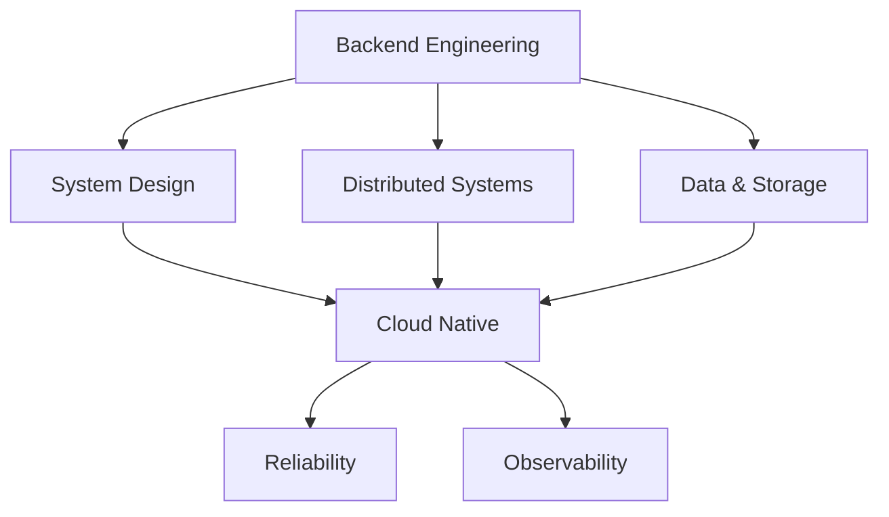

# Hi, I'm xiaobinqt 👋

### Backend Engineer · Go · Open Source

Building reliable backend systems, developer tools, and infrastructure.

 

---

## 👨‍💻 About Me

I'm a backend engineer primarily working with **Go** and **PHP**.

I enjoy understanding how systems work under the hood and turning complex engineering problems into simple, maintainable solutions.

* 🔨 Building **backend services, developer tools, and infrastructure**
* 🏗️ Interested in **system design, distributed systems, and software architecture**
* ☁️ Exploring **cloud-native technologies and reliable system design**
* 🤝 Contributing fixes and improvements to **open-source projects**
* ✍️ Writing about software engineering and what I learn along the way

---

## 🛠 Tech Stack

**Languages**

**Backend & Data**

**Infrastructure**

---

## 🤝 Open Source Contributions

I enjoy contributing bug fixes and improvements back to the open-source projects I use and appreciate.

<table>
<tr>

<td width="33%" valign="top" align="center">

### 🔴 [Node-RED](https://github.com/node-red/node-red)

`node-red/node-red`

</td>

<td width="33%" valign="top" align="center">

### 🖥️ [Next Terminal](https://github.com/dushixiang/next-terminal)

`dushixiang/next-terminal`

</td>

<td width="33%" valign="top" align="center">

### 💬 [openwechat](https://github.com/eatmoreapple/openwechat)

`eatmoreapple/openwechat`

</td>

</tr>

<tr>

<td width="33%" valign="top" align="center">

### ❤️ [LoveIt](https://github.com/dillonzq/LoveIt)

`dillonzq/LoveIt`

</td>

<td width="33%" valign="top" align="center">

### 💚 [Weixin](https://github.com/SocialiteProviders/Weixin)

`SocialiteProviders/Weixin`

</td>

<td width="33%" valign="top" align="center">

### 🔐 [base64Captcha](https://github.com/mojocn/base64Captcha)

`mojocn/base64Captcha`

</td>

</tr>

<tr>

<td width="33%" valign="top" align="center">

### ⚙️ [YaoApp/gou](https://github.com/YaoApp/gou)

`YaoApp/gou`

</td>

<td width="33%" valign="top" align="center">

### 📚 [CS-Base](https://github.com/xiaolincoder/CS-Base)

`xiaolincoder/CS-Base`

</td>

<td width="33%" valign="top" align="center">

### ⌨️ [qwerty-learner](https://github.com/RealKai42/qwerty-learner)

`RealKai42/qwerty-learner`

</td>

</tr>
</table>

---

## 🧭 Engineering Focus

`System Design` · `Distributed Systems` · `Domain-Driven Design`

`Database & Cache` · `Cloud Native` · `Reliability` · `Observability`

---

## 🚀 Projects

I build and maintain projects around **backend engineering, developer tooling, automation, and infrastructure**.

### ↓ Explore my pinned repositories ↓

---

## ✍️ Writing

I keep technical notes and write about problems I encounter while building software.

`Go` · `PHP` · `MySQL` · `Redis` · `Linux` · `Networking`

`Docker` · `Kubernetes` · `Backend Architecture` · `Engineering Practices`

 

---

### Keep building. Keep learning.

*Why fear the infiniteness of truth?*
*Each inch forward brings an inch of joy.*

